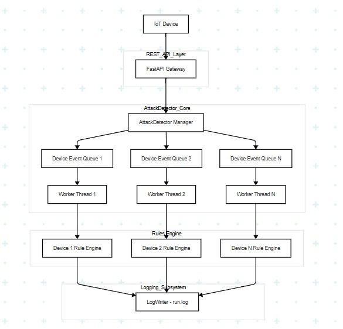

# Cyber-Attack Detection for Smart-Home / IoT Installations

*Milestone 4 – “Cyber-Attack Detection in a Smart-Home System”*

<p align="center">
  
</p>

> **TL;DR** — singleton FastAPI gateway, **14** rule-based detectors, dual-channel logging, **22** unit tests for the core engine and **26** integration/API tests.
> **Python 3.11 · FastAPI **

---

## 1 Introduction & Approach

Consumer IoT devices ship with minimal security and share a flat home LAN.
The objective is to **differentiate cyber-attack traffic from authorised requests in real time** without resorting to heavyweight ML or external databases.

We take a *lightweight, rule-driven* path:

* IoT devices POST JSON **`Event`** objects to `POST /events`.
* A singleton **`AttackDetector`** evaluates each event against **14 sliding-window rules** (rate-, value- and role-based).
* Verdicts go to plain-text `logs/run.log`; alerts also append ND-JSON lines to `logs/attack_detection.log`.
* All state lives in RAM — no external storage is required.

---

## 2 Project Layout & Quick Start

```
attack-detection-system/        # <— repo root
├── src/
│   ├── detector/
│   │   ├── attack_detector.py   # singleton core
│   │   ├── rules.py             # 14 detection rules
│   │   ├── log_writer.py        # dual-channel logging
│   │   ├── event.py             # Event dataclass
│   │   └── instrumentation.py   # one-liner snippet helper
│   └── api/
│       └── server.py            # FastAPI gateway
├── device_client_example.py     # IoT device simulator
├── api_auth_demo.py             # admin-API walk-through
├── test_example_usage.py        # 22 core-engine tests
├── test_api.py                  # 26 API/integration tests
└── docs/                        # assignment brief + figures
```

```bash
# ➊ clone & set up
git clone https://github.com/RuchchaSD/assignment_4.git attack-detection-system
cd attack-detection-system
python -m venv .venv && source .venv/bin/activate        # Win: .venv\Scripts\activate
pip install -r requirements.txt                          # fastapi, uvicorn, pytest …

# ➋ run the gateway in one terminal
uvicorn src.api.server:app --reload

# ➌ fire a demo burst in another terminal
python device_client_example.py

# ➍ run tests
python tests/test_api.py                                             # should report 48 tests = 22 + 26
python tests/test_example_usage.py
```

---

## 3 High-Level Architecture

| Layer / Component  | Responsibility                                                           | Key Module           |
| ------------------ | ------------------------------------------------------------------------ | -------------------- |
| **Device snippet** | Serialises a local action into `Event` and `POST /events`                | `instrumentation.py` |
| **REST gateway**   | JSON validation, queueing, Swagger & auth-guarded admin routes           | `server.py`          |
| **AttackDetector** | Thread-per-device workers, passes events through rules, sets global flag | `attack_detector.py` |
| **Rules Engine**   | 14 pure-function detectors with per-rule sliding windows                 | `rules.py`           |
| **LogWriter**      | Writes plain `run.log` (all) and ND-JSON `attack_detection.log` (alerts) | `log_writer.py`      |

```python
# attack_detector.py – enqueue API (excerpt)
class AttackDetector:
    _instance: "AttackDetector" | None = None

    def handle_event(self, evt: Event) -> None:
        """Public entry point called by instrumentation or API."""
        self._ensure_worker(evt.source_id)
        self._device_queues[evt.source_id].put(evt)
```


---

## 4 Implemented API End-Points  *(FastAPI, `server.py`)*

| Method     | Path               | Purpose                         | Auth |
| ---------- | ------------------ | ------------------------------- | ---- |
| **GET**    | `/`                | service banner + links          | ❌    |
| **GET**    | `/health`          | uptime & version                | ❌    |
| **POST**   | `/events`          | queue a security event          | ❌    |
| **GET**    | `/status`          | current suspicious flag + stats | ❌    |
| **POST**   | `/status/clear`    | reset suspicious flag           | ✅    |
| **POST**   | `/config/users`    | add / update user privilege     | ✅    |
| **POST**   | `/config/devices`  | register device                 | ✅    |
| **POST**   | `/config/commands` | update dangerous-command list   | ✅    |
| **GET**    | `/config/stats`    | overview of current config      | ✅    |
| **GET**    | `/logs/attacks`    | tail of `attack_detection.log`  | ✅    |
| **DELETE** | `/system/shutdown` | graceful detector shutdown      | ✅    |

(API key header: \*\*`X-API-Key: secret-api-key-12345`.)
Endpoints confirmed in `server.py` .

---

## 5 Rule Catalogue (14 rules)

| Rule label                                                               | Category                | Default trigger (configurable)          | Function                                      |
| ------------------------------------------------------------------------ | ----------------------- | --------------------------------------- | --------------------------------------------- |
| `NON_LAN_ACCESS`, `INVALID_IP_FORMAT`                                    | Network validation      | IP outside RFC1918 / malformed          | `_detect_non_lan_access`, `_detect_ip_format` |
| `UNKNOWN_DEVICE`, `UNKNOWN_USER`, `INVALID_ROLE`, `PRIVILEGE_ESCALATION` | Identity validation     | see docs                                | `_validate_user_and_device`                   |
| `BRUTE_FORCE_LOGIN`                                                      | Auth rate limit         | > 5 fails in 60 s                       | `_detect_brute_force`                         |
| `COMMAND_INJECTION`                                                      | Command spam            | > 3 dangerous cmds in 30 s              | `_detect_command_injection`                   |
| `INVALID_POWER_DATA`, `POWER_OUT_OF_RANGE`, `POWER_ANOMALY`              | Sensor sanity / anomaly | numeric checks & spike > 1.5 × baseline | `_detect_power_anomaly`                       |
| `RESOURCE_EXHAUSTION`                                                    | Resource abuse          | CPU/MEM ≥ 80 % for 60 s                 | `_detect_resource_abuse`                      |
| `SYN_FLOOD`                                                              | Network DoS             | > 100 SYN pkt/s                         | `_detect_network_attack`                      |
| `MESSAGE_FLOOD`                                                          | MQTT spam               | > 20 k msgs in 100 s                    | `_detect_message_flood`                       |

The rules short-circuit; first hit returns a `Verdict`. Code in `rules.py` .

---

## 6 Test Suites & Coverage

* **`test_example_usage.py`** — 22 unit tests hitting every rule plus baseline cases .
* **`test_api.py`** — 26 integration tests covering the same rule set *via HTTP* plus auth and config flows .


